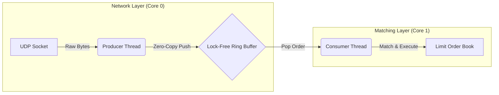

# ⚡ Velocity Engine: Low-Latency HFT Matching Engine


**Velocity Engine** is a high-frequency trading (HFT) limit order book built from the ground up to minimize latency.

Unlike traditional matching engines, Velocity abandons pointer-heavy data structures and blocking synchronization in favor of **cache-friendly memory layouts**, **zero-copy parsing**, and **lock-free concurrency**, achieving a median end-to-end matching latency of **~280 nanoseconds**.

---

## 📈 Optimization Journey: From Baseline to HFT

This engine evolved through three profiling-driven phases, each targeting a specific hardware bottleneck commonly found in standard C++ systems.

### Phase 1: Naive Implementation (Baseline)

* **Approach:** `std::map` (Red–Black Tree) for the order book and `std::mutex` for synchronization.
* **Bottlenecks:**

  * Non-contiguous memory → frequent **CPU cache misses**
  * `std::mutex` → OS context switches and non-deterministic latency spikes
* **Result:** ~5–10 µs latency (not HFT-viable)

### Phase 2: Memory Optimization (Cache Locality)

* **Solution:** Replaced `std::map` with pre-allocated `std::vector`-based price levels
* **Why it works:**

  * Contiguous memory enables **hardware prefetching** into L1/L2 cache
  * Removed all runtime allocations from the hot path using `.reserve()`
* **Result:** ~1 µs latency

### Phase 3: Lock-Free Architecture (Current)

* **Solution:**

  * Custom **Single-Producer Single-Consumer (SPSC) ring buffer** using C++20 atomics
  * Zero-copy parsing of NASDAQ ITCH 5.0 messages
* **Key optimizations:**

  * `alignas(64)` on head/tail indices to avoid **false sharing**
  * `memory_order_acquire` / `memory_order_release` for minimal synchronization cost
  * `reinterpret_cast` to overlay protocol structs directly on network buffers
* **Result:** **~280 ns median latency** 🚀

---

## 🏗️ System Architecture

A lock-free pipeline cleanly decouples network ingestion from matching logic.



---

## 🔑 Key Technical Features

| Feature           | Implementation                                          |
| ----------------- | ------------------------------------------------------- |
| Lock-Free Queue   | Custom SPSC ring buffer using atomics                   |
| Zero-Copy Parsing | Direct struct overlay on raw NASDAQ ITCH buffers        |
| Endianness        | `__builtin_bswap*` used only when required              |
| Cache-Line Safety | `alignas(64)` to prevent false sharing                  |
| Branch Prediction | `[[likely]]` / `[[unlikely]]` to reduce pipeline stalls |

---

## 📊 Performance Benchmarks

Benchmarked using **Google Benchmark** on isolated CPU cores to minimize OS noise.

| Operation    | Median Latency | Throughput    | Description             |
| ------------ | -------------- | ------------- | ----------------------- |
| Add Order    | 36 ns          | ~27M ops/sec  | Insert new limit order  |
| Match Trade  | 284 ns         | ~3.5M ops/sec | Parse → Match → Execute |
| Cancel Order | 45 ns          | ~22M ops/sec  | Remove order by ID      |

---

## 🛠️ Build & Run

### Prerequisites

* C++20 compliant compiler (GCC ≥10, Clang ≥10, MSVC)
* CMake ≥3.20
* Python 3 (for traffic simulation)

### Clone

```bash
git clone https://github.com/your-username/velocity-engine.git
cd velocity-engine
```

### Build

```bash
mkdir build && cd build
cmake .. -DCMAKE_BUILD_TYPE=Release
cmake --build .
```

### Run Engine

```bash
./OrderBook
```

### Simulate Traffic (separate terminal)

```bash
python3 scripts/send_orders.py
```

---

## 🔮 Future Improvements

* **Kernel Bypass:** DPDK / Solarflare OpenOnload
* **SIMD Acceleration:** AVX-512 price-level comparisons
* **Thread Pinning:** `pthread_setaffinity_np` for NUMA isolation
* **Multi-Book Scaling:** One matching core per instrument

---
## Build & Run
```bash
mkdir build && cd build
cmake ..
cmake --build . --config Release
./OrderBook.exe


